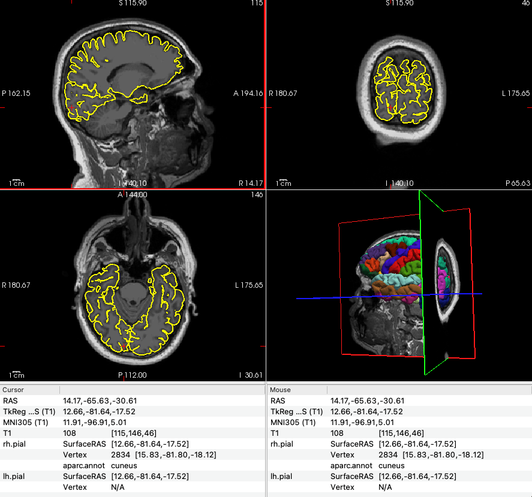

# Measuring Cortical Thickness in V1 using Freesurfer

Measuring cortical thickness in the primary visual cortex (V1), focusing on the `pericalcarine` region, using Freesurfer. 

## Prerequisites

- Ensure Freesurfer is installed and properly configured on your system.
- Have the subject’s T1-weighted MRI scan available for processing.

### 1. Environment Setup

Open a terminal and set the `SUBJECTS_DIR` environment variable to point to the directory where Freesurfer will store processing outputs. Replace `/path/to/your/freesurfer_subjects_directory` with the actual path to your subjects directory.

```bash
export SUBJECTS_DIR=/path/to/your/freesurfer_subjects_directory
```
### 2. Running `recon-all`

Navigate to the directory containing the T1-weighted MRI. Start Freesurfer's processing pipeline using `recon-all`. Replace `subjid` with your subject's unique identifier, and `/path/to/T1.nii` with the actual path to the T1-weighted MRI file.

```bash
recon-all -s subjid -i /path/to/T1.nii -all
```

This will take several hours to complete!!!!!!!!!!!! maybe try FastSurfer if you are impatient! 

### 3. Visualising Processed Data




Once `recon-all` has finished, use `freeview` to visually inspect the cortical parcellations, including the `pericalcarine` area.

```bash
freeview -v $SUBJECTS_DIR/subjid/mri/T1.mgz \
         -f $SUBJECTS_DIR/subjid/surf/lh.pial:annot=aparc.annot \
         -f $SUBJECTS_DIR/subjid/surf/rh.pial:annot=aparc.annot
```

Explore the parcellations to familiarise yourself with the anatomical structures.

### 4. Extracting Cortical Thickness Measurements

For the `pericalcarine` region, use `mris_anatomical_stats` to extract cortical thickness measurements. Perform this for both hemispheres:

Right hemisphere command:

```bash
mris_anatomical_stats -b -f $SUBJECTS_DIR/subjid/stats/rh.aparc.stats subjid rh
```


Repeat for the left/right hemisphere by replacing `rh` with `lh`.

### 5. Reviewing Results

Open the `rh.aparc.stats` and `lh.aparc.stats` files located in `$SUBJECTS_DIR/subjid/stats` to find detailed measurements. Search for the `Pericalcarine` entry for cortical thickness metrics.

### 6. Interpreting Data

The `Pericalcarine` entry provides average cortical thickness, surface area, volume, and other metrics for the primary visual cortex region (not actually, but as a practice assume this is the case). Use these measurements for comparisons or correlations.
